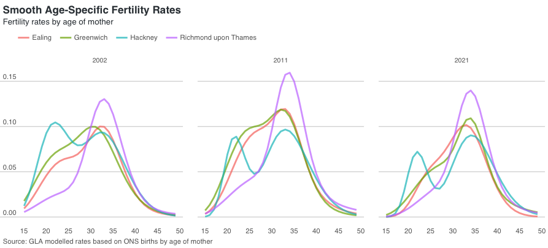
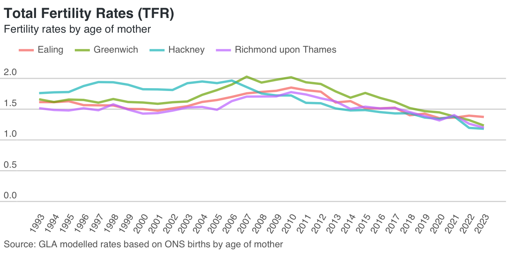
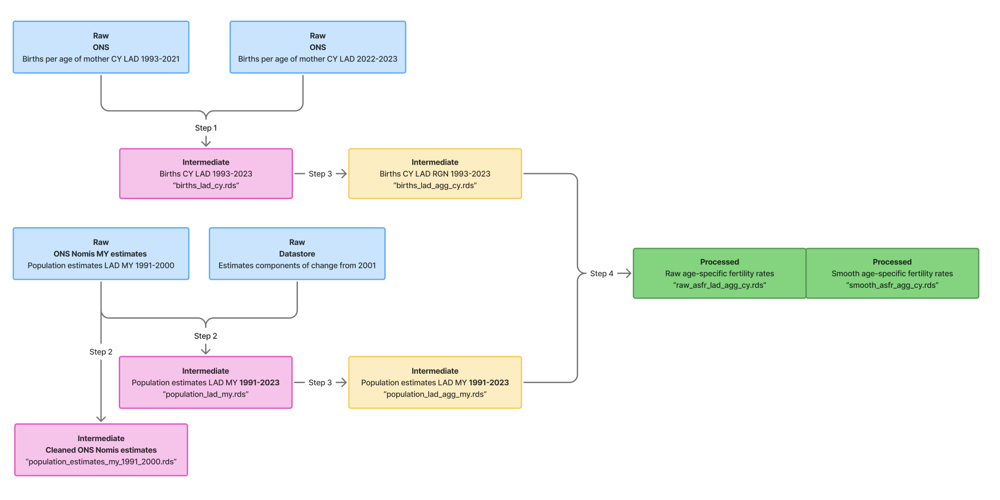

# Fertility Rate Estimates

The aim of this project is to give public access to the GLA's fertility rate estimates, for the purpose of research reproducibility and knowledge sharing. 

Fertility rates are a key component of population estimates and projections. It represents, in combination with mortality rates, the natural change in populations. 

Age-specific fertility estimates are used to project future fertility rates and births, serving as inputs to the GLA's annual population projections. 

## Getting started

To avoid path issues, open the R project `fertility_rate_estimation.Rproj`.

Packages and dependencies are managed via `renv`. The `R/run_all` script begins with `renv::restore()`, to ensure that all the necessary packages are installed.

Inside the same file, run `get_fertility_rate_estimates_data()` to download and process all required data, and calculate fertility estimates. All the ouputs will be saved in the `data` directory, which is then further divided into `raw`, `intermediate` and `processed`. The final outputs containing the raw and smooth fertility rate estimates will be saved under the `processed` directory.

### Technical notes and methodology

Once all outputs have been created and are saved under `data/processed`, run `rmarkdown::render("fertility_rate_analysis.Rmd")` to create a html file with technical notes, methodology and preliminary analysis. The html output will be saved in the root directory. 

Several plots can be adapted to display raw and smooth age-specific fertility rates and total fertility rates for selected years and/or local authorities of interest.

### Requirements

#### Nomis API 

We use the `nomisr` package to download ONS mid-year population estimates from Nomis. To download all the necessary data you'll need an Nomis account. Guest users are only allowed to download 350,000 rows, while registered users can send requests of up 1,500,000 rows.

1. Register for a free [Nomis account](https://www.nomisweb.co.uk/myaccount/userjoin.asp)
2. Go to `home > My Account > Nomis API` and copy your API Key under 'Your Unique ID'
3. Add `NOMIS_API_KEY="Nomis API key"` to your `.Renviron` file

## Data
### Data workflow

### Source data

All data used in this project is publicly available, broken down by local authority district:

- ONS calendar year births by age of mother from 1993
- ONS mid-year population estimates from 1991 - 2000
- GLA estimates components of change modelled backseries from 2000

Only births by age of mother and population estimates are needed to calculate age-specific fertility rates, both provided by the ONS. From 2000, we switch from the ONS population data to the GLA modelled population backseries, which provides a revised methodology for the allocation of *unattributable population change (UPC)*. The GLA's methodology treats UPC as migration flows, providing more useful estimates and projections at the local level in areas with high levels of migration, such as London. 

For more information on the GLA's modelled population backseries, including methodology [visit the London Datastore website](https://data.london.gov.uk/dataset/modelled-population-backseries/).

### Prepared data

Once we download all the data, we perform the following cleaning steps:

**Births**
1. Extract the data spread between spreedsheets and excel tabs into one dataset.
2. Use the GLA's `gsscoder` package to recode local authorities boundaries, currently to 2023.
3. Split combined local authorities, in the case of births Hackney & City of London and the Isles of Scilly & Cornwall

**Population**
1. Simple wrangling, renaming columns and ensuring that age is numeric
2. Merge population estimates from Nomis with GLA's revised modelled backseries

Both datasets are then aggregated by region, country, inner/outer London and International Territorial Level 2. The prepared data is saved in the `data/intermediate` directory.

### Final output

Raw and smooth fertility rates are calculated using calendar-year births by age of mother and population estimates for the period. Both datasets will contain:

*gss_code* - local authority district code
*gss_name* - local authority name \
*age* - age of mother, 15 to 49 years \
*sex* - female \
*year* - calendar year \
*geography* - administrative division, e.g., local authority 2023 boundaries (LAD23), country (CTRY), region (RGN) \
*fertility_rate* - fertility rates, raw or smooth depending on the dataset

Both datasets will be saved in the `data/processed` directory.

## Tests 

All unit tests are in `tests/testthat`. Run `testthat::test_dir("tests/testthat")` to test main functions.

## Authors

* Ben Corr
* Marta Lapsley
* Izabel Bahia

## Contact

If you have any questions or would like to raise an issue you can email the Demography team (demography@london.gov.uk) or [raise an issue](https://github.com/Greater-London-Authority/fertility_rate_estimation/issues).

